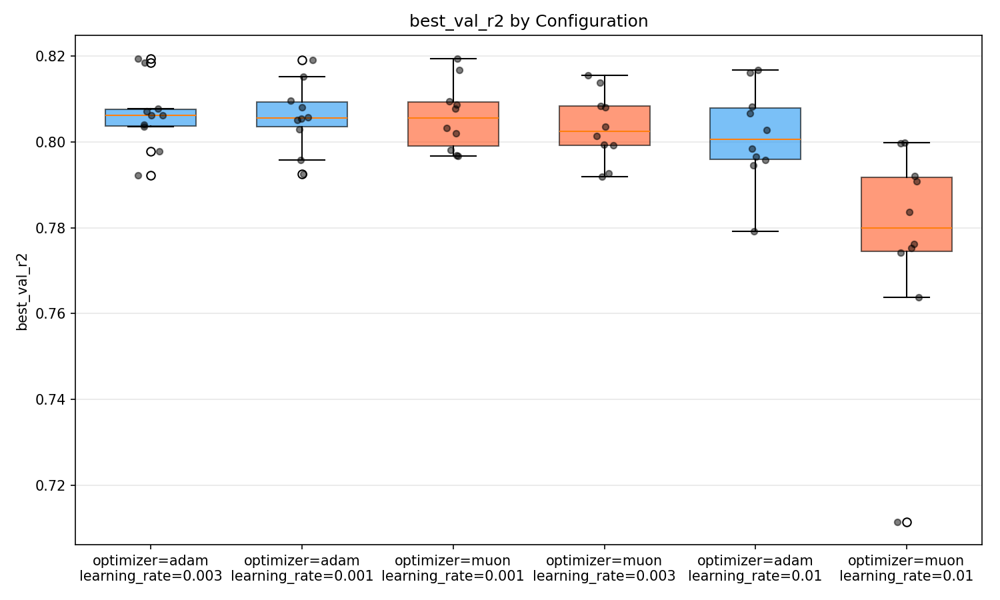
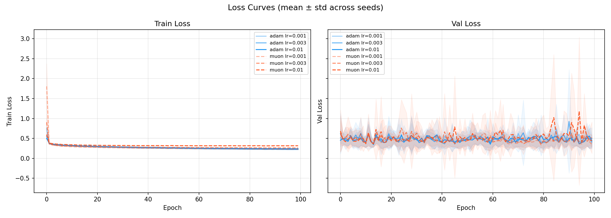
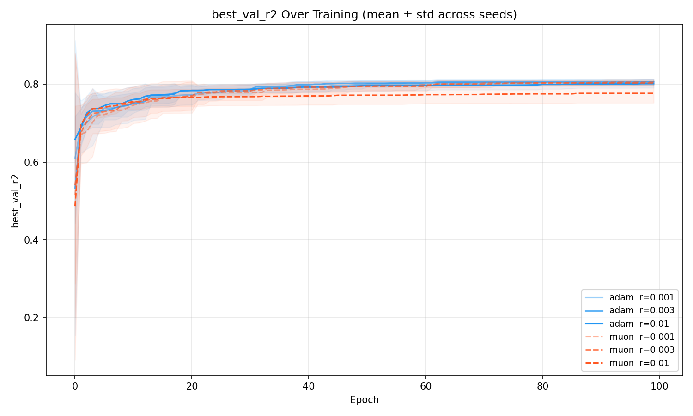
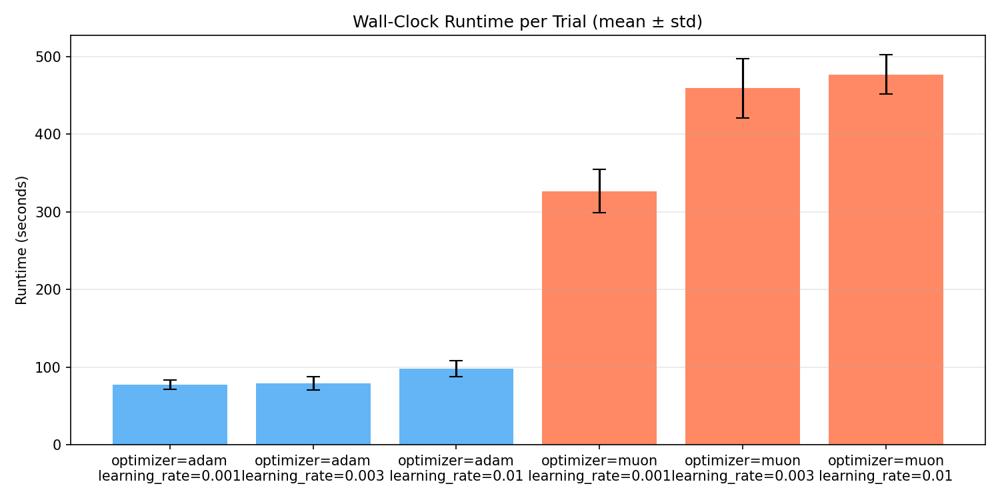
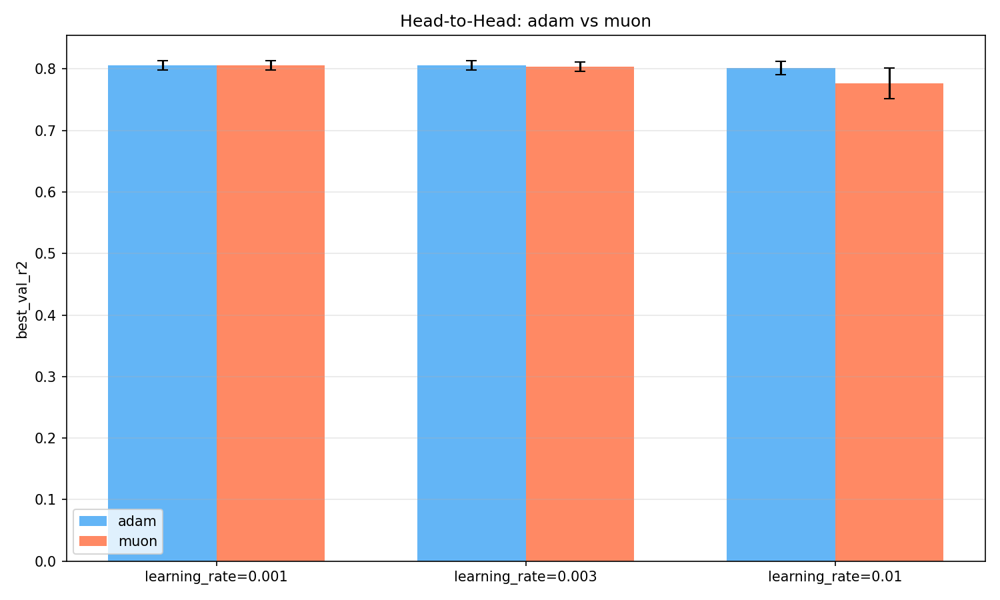

# Sweep Analysis: adam-vs-muon

- **Entity/Project**: hiremath-sujai1/adam-vs-muon
- **Runs**: 60
- **Primary metric**: best_val_r2
- **W&B**: https://wandb.ai/hiremath-sujai1/adam-vs-muon?group=adam-vs-muon

## Summary Table

| Config | best_val_r2 (mean±std) | Val Loss | Runtime | N |
|--------|------------------------|----------|---------|---|
| optimizer=adam, learning_rate=0.003 | 0.8062 ± 0.0078 | 0.5012 | 79s | 10 |
| optimizer=adam, learning_rate=0.001 | 0.8060 ± 0.0075 | 0.3952 | 78s | 10 |
| optimizer=muon, learning_rate=0.001 | 0.8059 ± 0.0076 | 0.3420 | 327s | 10 |
| optimizer=muon, learning_rate=0.003 | 0.8034 ± 0.0077 | 0.5175 | 459s | 10 |
| optimizer=adam, learning_rate=0.01 | 0.8015 ± 0.0106 | 0.4369 | 98s | 10 |
| optimizer=muon, learning_rate=0.01 | 0.7767 ± 0.0244 | 0.4478 | 477s | 10 |

## Key Findings

1. Best config: optimizer=adam, learning_rate=0.003 (best_val_r2=0.8062), beating runner-up (optimizer=adam, learning_rate=0.001) by 0.0003

2. Effect of optimizer: spread = 0.0092. Best level: optimizer=adam (best_val_r2=0.8046). Ranking: adam(0.8046) > muon(0.7953)

3. Effect of learning_rate: spread = 0.0168. Best level: learning_rate=0.001 (best_val_r2=0.8059). Ranking: 0.001(0.8059) > 0.003(0.8048) > 0.01(0.7891)

4. Most stable: optimizer=adam, learning_rate=0.001 (std=0.0075). Least stable: optimizer=muon, learning_rate=0.01 (std=0.0244)

5. Runtime: fastest=optimizer=adam, learning_rate=0.001 (78s), slowest=optimizer=muon, learning_rate=0.01 (477s), ratio=6.1x

6. Head-to-head (adam vs muon):
  learning_rate=0.001: adam=0.8060 vs muon=0.8059 -> adam wins
  learning_rate=0.003: adam=0.8062 vs muon=0.8034 -> adam wins
  learning_rate=0.01: adam=0.8015 vs muon=0.7767 -> adam wins

## Plots

